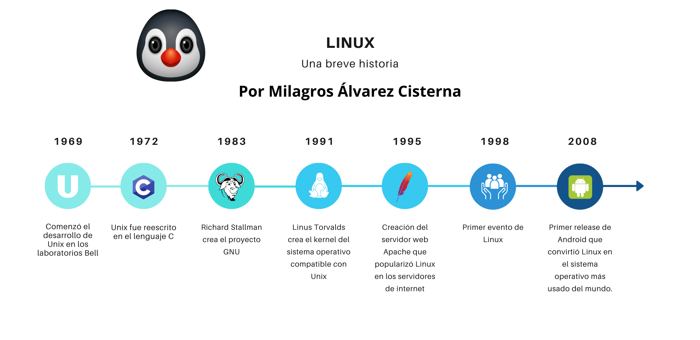
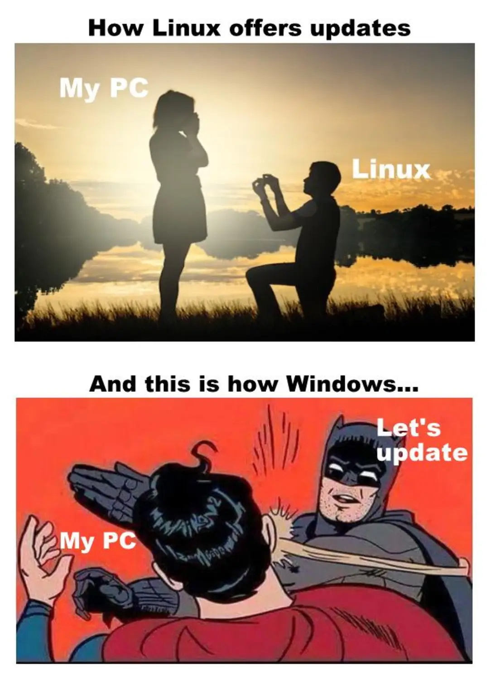
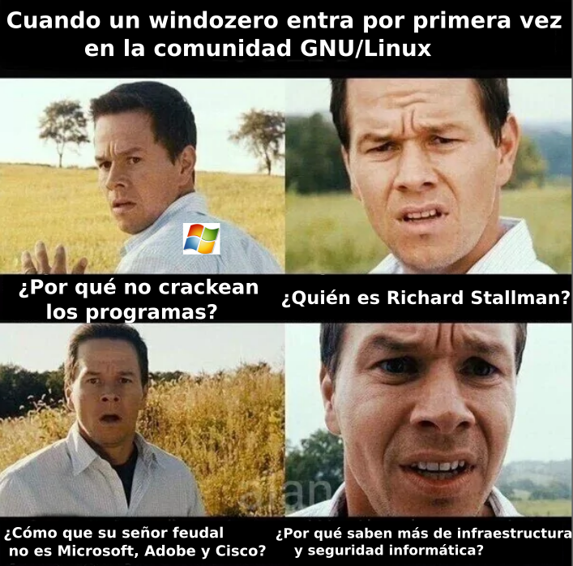

> Puedes probar algunos comandos de linux
> tocando el ícono de la terminal arriba en la barra de tareas.

## Desempeño práctico de Sistemas Operativos 2 - 2024
### Profesor: Emmanuel Galiotti
### Alumno: Milagros Desireé Álvarez Cisterna

## 1. Breve historia de Linux

### Línea de tiempo de la historia de Linux

Se puede agrandar haciendo click en la imagen:

<iframe class='video' width="560" height="315" src="https://www.youtube.com/embed/rjzU6D7XY7c?si=I0lD5gCmsFuq6bSc" title="YouTube video player" frameborder="0" allow="accelerometer; autoplay; clipboard-write; encrypted-media; gyroscope; picture-in-picture; web-share" referrerpolicy="strict-origin-when-cross-origin" allowfullscreen></iframe>

### Ventajas de Linux

Linux tiene diversas ventajas para distintos tipos de usos y distintos tipos de usuarios. A continuación se analizan algunos aspectos:

#### Seguridad

Desde hace muchos años linux es considerado más seguro qué otros sistemas operativos gracias a su diseño y su filosofía de desarrollo:

- Arquitectura de permisos: En linux los usuarios por defecto no tienen acceso completo al núcleo del sistema. Solamente los usuarios con privilegios administrativos (como el root) pueden realizar los cambios más críticos del sistema.
- Manejo de actualizaciones: Linux tiene un manejo agil de las actualizaciones de seguridad. La comunidad y los desarrolladores lanzan actualizaciones con frecuencia. Cada distribución gestiona sus parches de seguridad a traves de repositorios seguros propios.
- Variedad de herramientas de seguridad: Linux cuenta con herramientas de seguridad avanzadas como:
    - SeLinux (SecurityEnhanced linux) para controlar el acceso de las aplicaciones al sistema.
    - Firewalls como iptables y ufw.
    - Herramientas de cifrado como GPG y LUKS para proteger datos en el sistema.
- Mitigación de amenazas: La comunidad Linux reacciona ágil para detectar y mitigar posibles vulnerabilidades. El código abierto permite qué cualquiera pueda identificar un fallo y aplicar parches de manera más rápida qué en sistemas de código cerrado.

#### Estabilidad 

Linux es conocido por su alta estabilidad y confiabilidad, aspectos qué se valoran mucho en entornos de servidores y otras aplicaciones críticas.
- Estructura modular: El núcleo de linux es modular y está diseñado para una gestión eficiente de los recursos.
- Optimización de recursos: Linux hace un uso eficiente de la memoria RAM y el CPU permitiendo qué sistemas antiguos mantengan un rendimiento óptimo.
- Soporte de la comunidad: Al igual qué en la mitigación de amenazas mencionada anteriormente la comunidad juega un rol crucial en la detección y solución de los errores. Gracias a la naturaleza abierta, cualquier miembro puede identificar y corregir los errores rápidamente, dando lugar a un sistema más robusto.

#### Personalización

Otra de las ventajas más grandes de Linux radica en su flexibilidad para personalizar el sistema según los gustos y preferencias de cada usuario:
- Entornos de escritorio: Linux ofrece diferentes entornos de escritorio tales como GNOME, KDE Plasma, XFCE y LXDE qué se adaptan a los gustos de cada usuario. También aportan flexibilidad en los requisitos de cada usuario permitiendo llevar Linux a distintos tipos de computadoras
- Gestores de paquetes: Linux facilita la instalación de software mediante gestores de paquetes como APT, DNF o Pacman. Además existen gestores universales como snap y flatpak.
- Temas y Scripts: Se pueden cambiar los temas visuales, íconos y crear scripts personalizados para automatizar las tareas qué se hacen en el sistema.

#### Software Libre

El modelo de desarrollo de linux fomenta la innovación  y la colaboración:
- Transparencia: Todos podemos ver, modificar o distribuir el código de Linux permitiendo qué cualquiera pueda colaborar para mejorar el sistema.
- Accesibilidad: Al ser libre, cualquiera puede tomar el código compilarlo y distribuirlo de manera gratuita lo qué rompe barreras de accesos donde el factor económico podría ser un obstáculo.
- Libertad de modificación: Permite adaptar el sistema a las necesidades específicas de cada usuario o grupo lo qué da lugar a distribuciones especializadas para sectores diferentes. 

#### Aplicaciones de Linux

Linux se utiliza ampliamente en diversos campos tales como:

##### Desarrollo Web

- Linux es el sistema operativo más usado en todos los servidores web de internet, sobre todo gracias a la popularidad de herramientas como Apache y Nginx. LAMP (Linux Apache MySQL y PHP) es la base de una gran variedad de aplicaciones web.
- Frameworks muy conocidos como Dyango y Ruby on Rails funcionan de manera nativa en Linux facilitando el despliegue e integración.

##### Ciberseguridad

- Linux es la herramienta favorita para especialistas en ciberseguridad. Herramientas como Snort y Wireshark son las más utilizadas.
- Distribuciones como Kali Linux y Parrot Security OS están específicamente diseñadas para pruebas de penetración y análisis forense.

##### Ciencia y educación

- En ciencia, Linux se usa en bioinformática, para simulaciones científicas y análisis de datos.
Herramientas como R, Python, y MATLAB se ejecutan eficientemente en Linux permitiendo un entorno de análisis consistente.
- En educación Linux destaca en la enseñanza de programación y ciencias computacionales. Gracias a su naturaleza abierta los estudiantes pueden experimentar y aprender.

En conclusión todos estos aspectos hacen qué linux sea una plataforma robusta y versátil.

## 2. Inteligencia Artificial con Linux

### Bibliotecas y frameworks

Linux es el entorno más utilizado para el desarrollo de IA debido a su flexibilidad, posibilidad de personalización.

#### TensorFlow 
Es un framework de código abierto, fue desarrollado por Google, es utilizado para redes neuronales y algoritmos de machine learning. 

##### Ventajas

- +Optimo para procesamiento en paralelo, muy útil si se tienen muchas GPUs.
- Comunidad de soporte y una amplia cantidad de modelos qué ya están pre entrenados.
##### Casos de uso
- Reconocimiento de voz
- Visión artificial
- procesamiento de texto (NLP)

Instalación en Linux: se instala fácilmente con el instalador de paquetes pip.

####  PyTorch

Es una biblioteca desarrollada por Facebook, utilizada para el desarrollo e investigación en IA. La principal característica es “Dynamic Computation Graph” qué permite construir una red más intuitiva.

##### Ventajas

- Simple y flexible para construir modelos, lo que ayuda al desarrollo experimental
- Buen rendimiento en entrenamiento en paralelo en GPU

##### Casos de uso
- Visión por computadora
- Procesamiento natural del lenguaje

Instalación en Linux: También se puede instalar utilizando pipy es compatible con cuda lo que nos hace más fácil integrarlo con GPU              

#### Scikit-learn  

Es una biblioteca de Machine learning en Python que se construyó sobre Numpy, Scypy, Matplot Lib es ideal para tareas tradicionales cómo clasificación regresión clusters y reducción de dimensiones.

##### Ventajas
- Posee una amplia colección de algoritmos y herramientas para hacer machine learning.
- Se integra de manera fácil con otras bibliotecas para análisis de datos y visualización.

##### Casos de uso:
- Clasificación de datos 
- Análisis de series de tiempo
- Análisis de regresiones

Instalación en Linux: se instala fácilmente usando pip

### Herramientas de aprendizaje automático

Linux ofrece una variedad de herramientas para el aprendizaje automático que facilitan el desarrollo la experimentación y la visualización de modelos de inteligencia artificial.

#### Jupyter Notebook

Es una aplicación que permite compartir y crear documentos que contiene código Es compatible con muchos lenguajes de programación y Python es 1 de los más comunes en la inteligencia artificial se puede integrar con tensorflow, scikit-learn, Pytorch esto permite poder entrenar y a su vez probar modelos en un mismo entorno

##### Aplicaciones
- Facilita la iteración rápida y a su vez poder depurar fácilmente el código ya que permite modificar y probar los modelos inmediatamente.
- Se pueden usar bibliotecas como Matplotlib  y Seaborn para poder explorar y también entender los datos, es decir que soporta Gráficos.
- Es útil para generar reportes y también presentaciones por eso es útil en proyectos de investigación y presentación de resultados.

#### Weka

Es un software de código abierto con interfaz gráfica de aprendizaje automático que está desarrollado en Java.  Incluye algoritmos de Machine Learning para clasificación, regresión, clustering, reglas de asociación y selección de atributos este software permite poder ejecutar y visualizar los resultados sin necesidad de programar.

##### Aplicaciones
- Es un excelente herramienta para construir modelos y explorar datos sin tener experiencia en programación
- Es útil para los modelos clásicos de Machine learning como los árboles de decisión
- Ofrecen comparaciones entre los distintos modelos es así que facilita poder seleccionar el mejor modelo para una tarea específica.

#### Orange

Es una plataforma visual para análisis de datos y machine learning.  Su interfaz es de tipo arrastrar y soltar esto hace que la creación de flujos de trabajo sea más fácil.  Permite procesar datos, visualizarlos y construir modelos sin necesidad de programar esto lo hace bastante accesible.

##### Aplicaciones
- Visualización de datos usando gráficos interactivos y diagramas esto facilita el análisis exploratorio.
- Permite poder experimentar con distintos algoritmos de Machine learning ya que su interfaz es gráfica.
- Debido a que la interfaz de esta herramienta facilita el entendimiento de los flujos de trabajo es popular para poder enseñar conceptos de inteligencia artificial.

### Aplicaciones de IA desarrolladas en Linux

#### Asistentes virtuales

Mycroft AI  es un asistente virtual, de código abierto que se ejecuta en Linux puede responder preguntas, controlar dispositivos inteligentes , gestión al calendario y también puede reproducir música.  Para interpretar los comandos de voz utiliza procesamiento de lenguaje natural.

##### Sistemas de recomendación

Empresas como Netflix, Spotify, Amazon usan Linux como base para los sistemas de recomendación. Si bien, estos sistemas de recomendación están patentados, también existen alternativas de código abierto que se utilizan en Linux para poder construir recomendaciones basadas en algoritmos de filtrado como por ejemplo surprise.
Los sistemas de recomendación utilizan el aprendizaje supervisado como así también el no supervisado y combinan tanto los datos del usuario y el contexto para poder predecir sus preferencias. Estos modelos suelen implementarse con frameworks como tensorflow en Linux.  Estos sistemas de recomendación se aplican en servicios de streaming, comercio electrónico y redes sociales para poder mejorar la experiencia del usuario a través de la personalización.

#### Análisis de imágenes

Las aplicaciones de análisis de imágenes  Como por ejemplo las de diagnóstico médico, reconocimiento facial son comunes en Linux. Open CV y tensorflow son utilizadas en Linux para realizar el procesamiento de imágenes.  Estos sistemas de análisis de imágenes se utilizan por ejemplo en radiografías en vehículos autónomos reconociendo señales y obstáculos y también en seguridad a través del reconocimiento facial.

#### Detección de fraudes

Los sistemas de detección de fraude en Linux son implementados en empresas financieras y de comercio electrónico para poder analizar las transacciones y detectar patrones anómalos.  La detección de fraudes está basada en modelos de  Machine learning que analizan los datos históricos y detectan patrones de fraude en tiempo real. Linux permite desplegar estos sistemas debido a su estabilidad y la capacidad que tiene de manejar grandes volúmenes de datos. para la gestión de flujo de datos en tiempo real son comunes las bibliotecas como Apache Kafka, scikit-learn.  Estos sistemas para detectar fraudes se aplican en pagos en líneas, transacciones bancarias , sistemas de crédito y ayudan a identificar actividades fraudulentas , sospechosas y a proteger la información del usuario.

## 3. Distribuciones de Linux

### ¿Por qué ubuntu es una de las mejores distribuciones para un desarrollador?

Para un desarrollador, Ubuntu es una de las distribuciones más recomendable y a su vez una de las más populares por las siguientes razones:

- La experiencia de usuario es amigable, fácil de instalar y también de mantener . su comunidad y su aporte hacen que sea una opción accesible para desarrolladores de todo seniority.
- Es compatible con numerosos programas y herramientas para el desarrollo,  Desde entornos de desarrollo integrados, frameworks , bibliotecas hasta compiladores.
- Ofrece versiones LTS que poseen actualizaciones en cuanto a seguridad y también son estables en el tiempo.
- Que esta distribución tenga una comunidad extensa y activa que proporciona documentación, tutoriales , la hace útil para poder resolver problemas y aprender novedosas técnicas de desarrollo.

### Las herramientas de desarrollo recomendadas para poder instalar en Ubuntu son:

- Git:  Es un control de versiones utilizado por cualquier desarrollador moderno. Instalación: `sudo snap install git`

- Visual Studio Code:  Es un editor de código ampliamente utilizado por desarrolladores coma es ligero pero potente. Instalación: `sudo snap install --classic code`

- Node js y npm: utilizados para desarrollar aplicaciones en JavaScript, del lado del servidor y del lado del cliente.Instalación: `sudo apt install nodejs npm`

- Docker: plataforma para ejecutar aplicaciones dentro de contenedores como asi también para desarrollar. Instalacion: `sudo apt install docker.io`

- Python y pip: herramientas fundamentales para el desarrollo en python. Instalación: `sudo apt install python3-pip`

- MySQL/PostgreSQL: sistemas de gestion de bases de datos, segun preferencia.
    Instalacion MySQL: `sudo apt mysql-server`
    Instalacion PostgreSQL: `sudo apt install postgresql`

- Apache/Nginx: servidores web qué se utilizan para aplicaciones web.
Instalacion Apache: `sudo apt install apache2`
Instalacion Nginx: `sudo apt install nginx`

#### Entorno de escritorio a utilizar:

Para un entorno de desarrollo en Ubuntu se recomienda GNOME, es el por defecto de Ubuntu, por estas razones:
- Como es el entorno predeterminado, la integración es nativa, por ende la experiencia de usuario qué ofrece es fluida.
GNOME esta diseñado para ser simple, la interfaz de usuario qué ofrece es limpia, minimizar distracciones, lo qué lo hace un benefactor directo en materia de productividad.
- Es extensible, a pesar de ser simple, estas extensiones permiten poder personalizar la apariencia del entorno y la funcionalidad según lo requiera cada desarrollador.
- La experiencia de usuario qué ofrece GNOME es coherente, permitiendo trabajar en un entorno bien integrado.

### ¿Por qué Linux Mint es ideal para una familia con estudiantes?

Linux Mint es una de las distribuciones de Linux más adecuadas para un entorno familiar, especialmente para familias con estudiantes de nivel primario y secundario. Esto se debe a varias razones que hacen que Mint sea una excelente elección:

1. **Facilidad de uso**: Linux Mint es conocida por su interfaz de usuario amigable y fácil de navegar, similar a la de Windows, lo que facilita su adopción por parte de estudiantes, padres y usuarios que están acostumbrados a sistemas Windows.

2. **Similitudes con Windows**: Su entorno de escritorio Cinnamon, que es el más popular en Mint, ofrece un diseño intuitivo y familiar para los usuarios que vienen de Windows, con un menú de inicio tradicional y una estructura de ventanas y menús que no requiere una curva de aprendizaje pronunciada.

3. **Comunidad y soporte activos**: La comunidad de Linux Mint es grande, activa y dispuesta a ayudar. Esto significa que los usuarios pueden encontrar la solución a casi cualquier problema en foros, blogs y documentación en línea, lo cual es especialmente útil para familias que pueden no tener expertise técnico.

4. **Estabilidad y seguridad**: Basado en Ubuntu, Linux Mint ofrece un sistema estable y seguro. Las actualizaciones de seguridad regulares y un enfoque en la estabilidad del sistema lo hacen adecuado para un ambiente de aprendizaje sin preocupaciones de interrupciones frecuentes.

### Aplicaciones educativas recomendadas para Linux Mint

1. **GCompris**: Un conjunto de aplicaciones educativas para niños de 2 a 10 años que cubre diversas áreas como matemáticas, lectura y ciencia.
   - Instalación: `sudo apt install gcompris`

2. **Tux Paint**: Una aplicación de dibujo fácil de usar para niños, que ayuda a desarrollar creatividad y habilidades artísticas.
   - Instalación: `sudo apt install tuxpaint`

3. **Khan Academy**: Aunque principalmente accesible desde el navegador, Khan Academy ofrece innumerables recursos para estudiantes de todas las edades en áreas como matemáticas, ciencias y humanidades.

4. **LibreOffice**: Un paquete de oficina gratuito que incluye Writer, Calc y Impress, ideal para que los estudiantes realicen tareas y proyectos escolares.
   - Instalación: Viene preinstalado en Linux Mint.

5. **Stellarium**: Un planetario de código abierto que permite a los estudiantes explorar las estrellas y planetas desde sus hogares.
   - Instalación: `sudo apt install stellarium`

### Entorno de escritorio: Cinnamon

Para una configuración familiar, se recomienda utilizar el entorno de escritorio Cinnamon de Linux Mint, por las siguientes razones:

1. **Familiaridad y simplicidad**: Cinnamon ofrece una experiencia de usuario muy similar a la de Windows, lo cual facilita la transición para los usuarios habituados a ese sistema operativo.

2. **Personalización moderada**: Mientras que es fácil de usar de inmediato, Cinnamon permite un nivel moderado de personalización que puede adaptarse a las preferencias de cada miembro de la familia sin ser abrumador.

3. **Desempeño eficiente**: Cinnamon es ligero en comparación con otros entornos de escritorio como GNOME, lo que significa que puede funcionar fluidamente en una amplia gama de hardware, incluidas computadoras más antiguas o menos potentes.

### Resumen

Linux Mint, especialmente en su edición con el entorno Cinnamon, es ideal para una familia con estudiantes, gracias a su facilidad de uso y similitud con Windows, lo cual minimiza la curva de aprendizaje. Su estabilidad, seguridad, y el respaldo de una amplia comunidad aseguran que los problemas puedan ser resueltos rápidamente, haciendo de Linux Mint una opción confiable para el uso diario y el aprendizaje. Las aplicaciones educativas disponibles también complementan esta experiencia al ofrecer recursos valiosos para el desarrollo académico de los estudiantes.

## 4. Supercomputadoras

Las supercomputadoras son herramientas esenciales en el mundo de la informática de alto rendimiento (HPC, por sus siglas en inglés) y se utilizan en aplicaciones que demandan una capacidad de procesamiento intensiva, como simulaciones científicas, modelado climático y análisis genómico. En este contexto, GNU/Linux se ha convertido en el sistema operativo dominante por diversas razones que detallamos a continuación:

1. **Eficiencia en el uso de recursos**: GNU/Linux es conocido por su eficiencia y capacidad de utilizar los recursos del sistema de manera óptima. A diferencia de otros sistemas operativos, Linux puede ser configurado para que funciones esenciales sean ejecutadas con un mínimo de sobrecarga, lo cual es crucial en ambientes donde el rendimiento es la máxima prioridad.

2. **Escalabilidad**: Linux ofrece una escalabilidad excepcional, lo cual es fundamental en entornos de alta disponibilidad y rendimiento. Las supercomputadoras a menudo requieren expandir sus capacidades de manera significativa, y Linux puede adaptarse fácilmente a estructuras que comprenden miles de nodos de procesamiento, garantizando un rendimiento eficiente sin deterioro.

3. **Soporte para la computación paralela**: La capacidad de realizar cálculos paralelos es esencial en el HPC. Linux no solo soporta las principales herramientas y bibliotecas de computación paralela, como MPI (Message Passing Interface) y OpenMP, sino que también facilita la gestión de múltiples procesadores y núcleos en una arquitectura de supercomputadora. 

4. **Compatibilidad con herramientas de desarrollo especializadas**: Una vasta gama de herramientas de software y bibliotecas científicas está diseñada para ejecutarse en sistemas Linux. Esto incluye compiladores de alto rendimiento, depuradores y frameworks de desarrollo como CUDA y TensorFlow, los cuales son ampliamente utilizados en ambientes académicos y científicos.

5. **Comunidad y soporte abiertos**: Linux, al ser un sistema operativo de código abierto, cuenta con una comunidad activa que contribuye continuamente a su mejora y soporte. Esto es invaluable para las organizaciones que operan supercomputadoras, ya que pueden personalizar el sistema operativo según sus necesidades específicas y beneficiarse del rápido desarrollo y la resolución de problemas proporcionados por la comunidad global.

6. **Costo y licencia**: Linux es generalmente más económico que sus alternativas comerciales debido a su licencia de código abierto. Sobre todo si tenemos en cuenta que muchos modelos de licenciamiento de software están atados a la capacidad del hardware donde estén instalados. Las organizaciones no tienen que pagar costosas tarifas de licencia, permitiéndoles dedicar más recursos a la mejora del hardware y otras áreas críticas de las operaciones de HPC.

Estas ventajas han convertido a GNU/Linux en la opción preferida para la mayoría de las supercomputadoras en operación hoy en día. La capacidad de Linux para proporcionar un entorno robusto, escalable y altamente personalizable lo hace ideal para satisfacer las demandas extremas de la informática de alto rendimiento.

## Conclusión

Para concluir, se puede decir que Linux es un sistema operativo que puede utilizarse en múltiples campos debido a su versatilidad, como así tambien a su seguridad, escalabilidad y personalización, estas caracteristicas lo posicionan entre las opciones más destacadas y elegidas. La fortaleza de su estructura de seguridad, que se basa en estrictos permisos y sólidas herramientas de gestión, lo posicionan entre una de las opciones mas elegidas para entornos en donde la seguridad de los datos resulta crucial. Además, se adapta eficazmente a las distintas cargas de trabajo, por ser altamente escalable, es por esto que es ideal para proyectos de cualquier magnitud.

Cabe destacar que Linux ofrece una flexibilidad sin igual, entonces le permite a los usuarios y desarrolladores poder adaptar el sistema operativo segun sus requerimientos y necesidades. Esto en conjunto con ser de codigo abierto, lo convierte en una plataforma preferida en el ambito del desarrollo de software y la IA.

A su vez, Linux es elegido predominantemente, en el ambito de supercomputadoras por ser eficiente. Tambien, en el contexto familiar, los usuarios pueden elegir en multiples opciones de distribuciones, lo cual garantiza una experiencia personalizada y segura.

## Referencias
- [ChatGPT](https://chat.openai.com/) para generar ideas iniciales, esquema y orden general de los temas.
- [Linux en Wikipedia](https://en.wikipedia.org/wiki/Linux)
- [Historia de Linux (Youtube)](https://www.youtube.com/watch?v=rjzU6D7XY7c&pp=ygUMZWR0ZWFtIGxpbnV4)
- [¿Por qué ubuntu es lo mejor para desarrollo web?](https://medium.com/@ajonesb/why-ubuntu-linux-reigns-supreme-for-web-development-87561d8b2f14)
- [¿Es Linux seguro (Karspersky)?](https://www.kaspersky.com/resource-center/definitions/linux)
- [¿Es Linux esencial para los cientificos de datos?](https://medium.com/@prxshetty/is-linux-essential-for-data-scientists-835e38a2290a)
- [Tensorflow en Wikipedia](https://en.wikipedia.org/wiki/TensorFlow)
- [Pytorch en Wikipedia](https://en.wikipedia.org/wiki/PyTorch)
- [Scikit-learn en Wikipedia](https://en.wikipedia.org/wiki/Scikit-learn)
- [Jupyter en Wikipedia](https://en.wikipedia.org/wiki/Project_Jupyter)
- [Weka en Wikipedia](https://en.wikipedia.org/wiki/Weka_(software))
- [Orange en Wikipedia](https://en.wikipedia.org/wiki/Orange_(software))
- [Mycroft en Wikipedia](https://en.wikipedia.org/wiki/Mycroft_(software) )
- [OpenCv en Wikipedia](https://en.wikipedia.org/wiki/OpenCV)
- [Uso de Linux en Netflix](https://prateeksrivastav598.medium.com/how-netflix-relies-on-linux-for-innovation-and-growth-90f92a567be0)
- [Mejor distribución para desarrolladores](https://www.techradar.com/best/best-linux-distro-for-developers)
- [Ubuntu es popular para desarrolladores](https://ubunlog.com/ubuntu-es-popular-para-desarrolladores/)
- [Centos VS Ubuntu](https://geekflare.com/es/centos-vs-ubuntu/)
- [Que ventajas tiene ubuntu](https://redessy.com/que-ventajas-tiene-ubuntu/)
- [Entorno de escritorio Gnome](https://sistemasoperativos.info/linux/entorno-de-escritorio-gnome/)
- [Supercomputadoras en Wikipedia](https://en.wikipedia.org/wiki/Supercomputer)
- [Linux en supercomputadoras](https://www.zdnet.com/article/linux-totally-dominates-supercomputers/)
- [Linux lider absoluto en supercomputadoras](https://www.xataka.com/especiales/linux-es-lider-absoluto-en-supercomputacion-por-que-windows-o-macos-no)
- [Las supercomputadoras prefieren linux](https://blogthinkbig.com/las-supercomputadoras-prefieren-linux)
- Este proyecto utiliza la libreria v86 de copy/v86 para ejecutar una versión de Linux en el navegador [Ver en Github](https://github.com/copy/v86)
- [Imagen de inteligencia artificial unsplash](https://unsplash.com/es/@owenbeard)
- [Imagen de ubuntu en unsplash](https://unsplash.com/es/@6heinz3r)